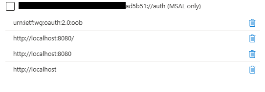

This workflow brings you through the process of an automatic deployment of the sales funneler solution.


## Prerequisites

Install Powershell 7
```powershell
winget install --id Microsoft.Powershell --source winget
```

Run as Administrator
```powershell
Start-Process pwsh -Verb RunAs
```

Configure Execution Policy
```powershell
Set-ExecutionPolicy -ExecutionPolicy RemoteSigned -Scope CurrentUser -Force
Get-ExecutionPolicy -List
```

Install PnP PowerShell module
```powershell
Install-Module -Name PnP.PowerShell -Force -AllowClobber -Scope CurrentUser
Get-Module -Name PnP.PowerShell -ListAvailable
mport-Module PnP.PowerShell -Force
```

Configure TLS/Security
```powershell
[Net.ServicePointManager]::SecurityProtocol = [Net.SecurityProtocolType]::Tls12
Set-PSRepository -Name 'PSGallery' -InstallationPolicy Trusted
```

Verify Access
```powershell
$siteUrl = "https://your-tenant-name.sharepoint.com/sites/your-site-name"
Connect-PnPOnline -Url $siteUrl -Interactive
```

Authentication methods will vary by site.  


If you get an auth error like this, create an app registration in entra, with redirect URIs as below:


## List configuration

The following scripts leverage interactive authentication, meaning you will be prompted for the modern dev click through authentication experience at each step, and giving you the opportunity to observe the changes to the sharepoint site.  If you do not pass arguments, it will prompt you for a Sharepoint Site name and a deployment prefix that will be prepended to the name of each table. 

Create List
```powershell
.\Deploy-Lists.ps1 -SiteUrl "https://your-tenant-name.sharepoint.com/sites/your-site-name/" -ListPrefix "yourPrefix" 
```

Flag Fields as required
```powershell
.\Set-Required-Fields.ps1 -SiteUrl "https://your-tenant-name.sharepoint.com/sites/your-site-name/" -ListPrefix "yourPrefix" 
```

Turn on list versioning, and add a multi-line plain text field with append
```powershell
.\Add-Comment-Log.ps1 -SiteUrl "https://your-tenant-name.sharepoint.com/sites/your-site-name/" -ListPrefix "yourPrefix" 
```

Populate list with sample data
```powershell
.\Add-Comment-Log.ps1 -SiteUrl "https://your-tenant-name.sharepoint.com/sites/your-site-name/" -ListPrefix "yourPrefix" 
```
## List fine tuning:
System should be functional, but the following are useful for production deployments:
* Calendar View in Lists
* Pill body colors for Status & Stage

### Form Body JSON
*I've been unsuccessful getting the body JSON to be applied via PnP because the `CustomFormatterBody` isn't allowed in PnP powershell.  Here's the JSON body to group the fields appropriately and consistently:
Opportunity
```json
{
    "sections": [
        {
            "displayname": "Basics",
            "fields": [
                "Opportunity Owner",
                "CustomerId"
            ]
        },
        {
            "displayname": "Status",
            "fields": [
                "Status",
                "Stage",
                "Next Milestone",
                "Next Deadline or Milestone"
            ]
        },
        {
            "displayname": "Financial Details",
            "fields": []
        },
        {
            "displayname": "",
            "fields": [
                "Opportunity Name",
                "Opportunity Value",
                "Win Probability",
                "Expected Close Date"
            ]
        }
    ]
}
```

Customer
```json
{
    "sections": [
        {
            "displayname": "Customer Details",
            "fields": [
                "Customer Name",
                "Website",
                "NAICS code",
                "Status"
            ]
        },
        {
            "displayname": "Primary Contact",
            "fields": [
                "Primary Contact",
                "Primary Contact Title"
            ]
        },
        {
            "displayname": "Alternate 1 Contact",
            "fields": [
                "Alternate Contact",
                "Alternate Contact Title"
            ]
        },
        {
            "displayname": "Alternate 2 Contact",
            "fields": [
                "Title",
                "Alternate Contact 2",
                "Alternate Contact 2 Title"
            ]
        }
    ]
}
```