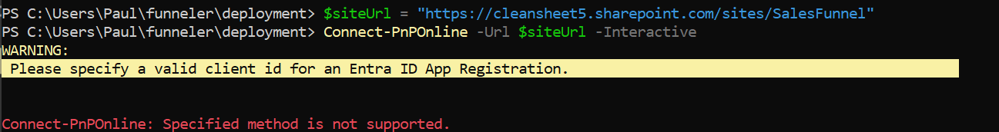

This workflow brings you through the process of an automatic deployment of the sales funneler solution.


## Preprequisites


Install Powershell 7
```
winget install --id Microsoft.Powershell --source winget
```
Run as Administrator
```
Start-Process pwsh -Verb RunAs
```
Configure Execution Policy
```
Set-ExecutionPolicy -ExecutionPolicy RemoteSigned -Scope CurrentUser -Force
Get-ExecutionPolicy -List
```
Install PnP PowerShell module
```
Install-Module -Name PnP.PowerShell -Force -AllowClobber -Scope CurrentUser
Get-Module -Name PnP.PowerShell -ListAvailable
mport-Module PnP.PowerShell -Force
```

Configure TLS/Security
```
[Net.ServicePointManager]::SecurityProtocol = [Net.SecurityProtocolType]::Tls12
Set-PSRepository -Name 'PSGallery' -InstallationPolicy Trusted
```

Verify Access
```
$siteUrl = "https://cleansheet5.sharepoint.com/sites/SalesFunnel"
Connect-PnPOnline -Url $siteUrl -Interactive
```
Authentication methods will vary by site.  


If you get an auth error like the one below, follow the steps in the app registration guide.