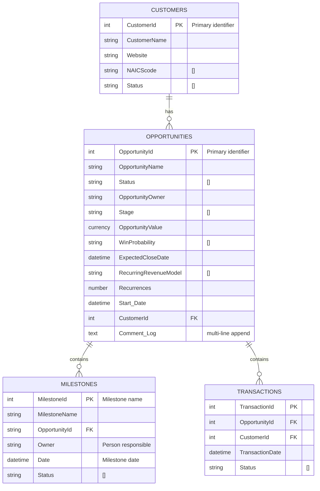

# Funneler Code Guide
The solution contains several types of code:
1. Power/Query/M for ETL into Excel and PBI
2. Excel functions (including modern array and LAMBDA) functions for calculation and visualization
3. Powershell for automated Day 1 and Day 2 operations against Sharepoint Lists

> This solution leverages array formulas only available in Office 365.

- [Funneler Code Guide](#funneler-code-guide)
  - [Architecture](#architecture)
  - [Relationship Diagram](#relationship-diagram)
  - [Mock Template Creation](#mock-template-creation)
  - [Excel](#excel)
    - [Formula Patterns](#formula-patterns)
      - [High Complexity Formulas](#high-complexity-formulas)
      - [Primary Formula Patterns](#primary-formula-patterns)
      - [External Dependencies](#external-dependencies)
    - [Function Inventory](#function-inventory)
      - [Function Inventory](#function-inventory-1)
      - [Named Ranges Inventory](#named-ranges-inventory)
    - [Interesting functions](#interesting-functions)
      - [Transactions](#transactions)
      - [Fiscal Year Calculations](#fiscal-year-calculations)
  - [Power Query (M Code)](#power-query-m-code)
    - [Opportunities Data Connection](#opportunities-data-connection)
    - [Customers Data Connection](#customers-data-connection)
    - [Transaction Table](#transaction-table)


## Architecture


## Relationship Diagram


> `Transactions` table is calculated via power query or Lambda function, depending on implementation

## Mock Template Creation
1. Load as desired, export to [mocks](../../deployment/day-1/MOCK/)

## Excel

### Formula Patterns

#### High Complexity Formulas

- **Dynamic Arrays**: Extensive use of UNIQUE, FILTER, SORTBY, and TRANSPOSE
- **Nested Lookups**: Multiple XLOOKUP functions with complex criteria
- **Structured References**: Heavy use of Excel table references (e.g., `View[[#This Row],[Id]]`)
- **Complex Text Operations**: Date formatting and URL generation

#### Primary Formula Patterns

1. **Data Lookup and Display**: XLOOKUP patterns for retrieving related data
2. **Dynamic Filtering**: FILTER and UNIQUE combinations for data analysis
3. **URL Generation**: HYPERLINK formulas for SharePoint integration
4. **Date Calculations**: Complex fiscal year and quarter calculations
5. **Data Visualization Support**: Array formulas for chart data preparation

#### External Dependencies
- SharePoint Lists (Opportunities, Customers)
- Named ranges for configuration settings
- External data connections for real-time updates


### Function Inventory

The spreadsheet uses 21 unique Excel functions:

#### Function Inventory

| Function | Usage | Description | When Introduced |
|----------|-------|-------------|-----------------|
| **Dynamic Array Functions (Office 365/2021)** |
| XLOOKUP | High | Advanced lookup function | 2020 (Excel for Office 365 version 2001/Build 12430.20184) |
| UNIQUE | Medium | Returns unique values | December 2019 (Excel for Office 365 version 1911/Build 12228.20332) |
| FILTER | Medium | Filters data arrays | December 2019 (Excel for Office 365 version 1911/Build 12228.20332) |
| SORTBY | Medium | Sorts data by criteria | December 2019 (Excel for Office 365 version 1911/Build 12228.20332) |
| LET | Low | Defines variables in formulas | December 2019 (Excel for Office 365 version 1911/Build 12228.20332) |
| **Modern Functions (Excel 2007-2019)** |
| SWITCH | Low | Multiple condition evaluation | Excel 2016 (2015) |
| **Classic Functions (Excel 97-2007)** |
| HYPERLINK | High | Creates clickable links | Excel 97 (1997) |
| SUBTOTAL | Medium | Subtotal calculations for dynamic filtering | Excel 97 (1997) |
| TRANSPOSE | Medium | Transposes arrays | Excel 1.0 (1987) - Available since early Excel versions |
| **Legacy Functions (Excel 1.0-95)** |
| IF | High | Conditional logic | Excel 1.0 (1987) - Core function since inception |
| MONTH | Medium | Extracts month from date | Excel 1.0 (1987) - Core date function |
| YEAR | Medium | Extracts year from date | Excel 1.0 (1987) - Core date function |
| RIGHT | Medium | Text extraction | Excel 1.0 (1987) - Core text function |
| CEILING | Low | Rounds up to nearest integer | Excel 1.0 (1987) - Core math function |
| ROUNDUP | Low | Rounds numbers up | Excel 1.0 (1987) - Core math function |
| TEXT | Low | Text formatting | Excel 1.0 (1987) - Core text function |
| CONCATENATE | Low | Text concatenation | Excel 4.0 (1992) |
| SUM | High | Summation | Excel 1.0 (1987) - Core function since inception |
| COUNT | Low | Count functions | Excel 1.0 (1987) - Core function since inception |
| MAX | Low | Maximum value | Excel 1.0 (1987) - Core function since inception |
| MIN | Low | Minimum value | Excel 1.0 (1987) - Core function since inception |


#### Named Ranges Inventory

| Name | Type | Reference | Sheet | Hidden | Description |
|------|------|-----------|-------|---------|-------------|
| calendarType | User Defined | Pipeline!$B$2 | Global | No | Calendar type setting |
| custList | User Defined | Settings!$E$2 | Global | No | Customer list reference |
| dateRange | User Defined | Pipeline!$D$2 | Global | No | Date range setting |
| fqStart | User Defined | Settings!$B$1 | Global | No | Fiscal quarter start |
| oppList | User Defined | Settings!$E$3 | Global | No | Opportunities list reference |
| pipelineType | User Defined | Pipeline!$B$3 | Global | No | Pipeline type setting |
| probabilityThreshold | User Defined | Settings!$B$2 | Global | No | Probability threshold setting |
| siteUrl | User Defined | Settings!$E$1 | Global | No | SharePoint site URL |
| _xlchart.v2.0 | Chart Range | graphics!$A$11:$A$16 | Global | Yes | Chart data series 1 |
| _xlchart.v2.1 | Chart Range | graphics!$C$11:$C$16 | Global | Yes | Chart data series 2 |
| ExternalData_1 | External Data | 'Customers'!$A$1:$K$31 | Customers | Yes | Customer Sharepoint List |
| ExternalData_2 | External Data | Opportunities!$A$1:$L$37 | Opportunities | Yes | Opportunity Sharepoint List |
| ExternalData_3 | External Data | Pipeline!$M$7:$M$43 | Pipeline | Yes | Pipeline View |
| Slicer_Close_Quarter | Slicer | #N/A | Global | No | Close quarter slicer |
| Slicer_Stage | Slicer | #N/A | Global | No | Stage slicer |

### Interesting functions
#### Transactions
The spreadsheet leverages a lambda function to generate a table of transactions from the recurrence data in the opportunity table:

> Although an interesting and fun approach, I will move this from lambda to M to avoid spill conditions and simplfiy downstream calculations and filtering.

```lambda
=LET(
    source_data, recurrence,
    ids, INDEX(source_data,,1),
    customer_ids, INDEX(source_data,,2),
    models, INDEX(source_data,,3),
    recurrences, INDEX(source_data,,4),
    start_dates, INDEX(source_data,,5),
    amounts, INDEX(source_data,,6),
    fq_values, INDEX(source_data,,7),
    cq_values, INDEX(source_data,,8),

    expanded_data, REDUCE(
        {"ID","CustomerID","Date","Amount","FQ","CQ"},
        SEQUENCE(ROWS(source_data)),
        LAMBDA(acc,i,
            LET(
                current_id, INDEX(ids, i),
                current_customer_id, INDEX(customer_ids, i),
                current_model, INDEX(models, i),
                current_recur, MAX(1, INDEX(recurrences, i)),
                current_start, INDEX(start_dates, i),
                current_amount, INDEX(amounts, i),
                current_fq, INDEX(fq_values, i),
                current_cq, INDEX(cq_values, i),

                interval_days, SWITCH(current_model,
                    "Monthly", 30,
                    "Quarterly", 91,
                    "Semi-Annually", 182,
                    "Annually", 365,
                    "Usage-based", 30,
                    "One-time", 0,
                    0
                ),

                dates_for_id, IF(current_model="One-time",
                    SEQUENCE(current_recur, 1, current_start, 0),
                    current_start + (SEQUENCE(current_recur) - 1) * interval_days
                ),

                ids_for_entry, SEQUENCE(current_recur, 1, current_id, 0),
                customer_ids_for_entry, IF(SEQUENCE(current_recur), current_customer_id),
                amounts_for_entry, SEQUENCE(current_recur, 1, current_amount, 0),
                fq_for_entry, IF(SEQUENCE(current_recur), current_fq),
                cq_for_entry, IF(SEQUENCE(current_recur), current_cq),

                current_block, HSTACK(
                    ids_for_entry,
                    customer_ids_for_entry,
                    dates_for_id,
                    amounts_for_entry,
                    fq_for_entry,
                    cq_for_entry
                ),

                VSTACK(acc, current_block)
            )
        )
    ),

    expanded_data
)
```

#### Fiscal Year Calculations
Based on the fiscal start declared in `fqStart`

```
="FY"&RIGHT(IF(MONTH([@Close])>=MONTH(fqStart),YEAR([@Close])+1,YEAR([@Close])),2)&"-Q"&IF(MONTH([@Close])>=MONTH(fqStart),CEILING((MONTH([@Close])-MONTH(fqStart)+1)/3,1),CEILING((MONTH([@Close])+12-MONTH(fqStart)+1)/3,1))
```

## Power Query (M Code)
These queries provide a reusable template for connecting to SharePoint sites and lists defined by variables within the workbook itself. To implement this code, developers should create two named ranges in their Excel workbook: "siteUrl" containing the SharePoint site URL, and "custList" containing the exact name of the customer list as it appears in SharePoint. The query automatically handles SharePoint authentication, filters to the specified list, and expands the customer data into a flat table structure suitable for Power BI integration or Excel analysis and visualization. 

### Opportunities Data Connection
I originally implemented using the legacy `Sharepoint.Tables` method, but migrated to REST API to (hopefully) resolve the comment log issue.

```m
/* Old Sharepoint.Tables version
let
    siteUrl = Excel.CurrentWorkbook(){[Name="siteUrl"]}[Content]{0}[Column1],
    listName = Excel.CurrentWorkbook(){[Name="oppList"]}[Content]{0}[Column1],
    Source = SharePoint.Tables(siteUrl, [Implementation=null, ApiVersion=15]),
    #"Filtered Rows" = Table.SelectRows(Source, each ([Title] = listName)),
    #"Removed Columns" = Table.RemoveColumns(#"Filtered Rows",{"Id", "Title"}),
    #"Expanded Items" = Table.ExpandTableColumn(#"Removed Columns", "Items", {"Id", "Title", "Status", "Stage", "Amount", "Probability", "CustomerId", "Close", "NextMilestone", "NextMilestoneDate", "Comment Log", "Customer"}, {"Id", "Title", "Status", "Stage", "Amount", "Probability", "CustomerId", "Close", "NextMilestone", "NextMilestoneDate", "Comment Log", "Customer"})
in
    #"Expanded Items"

*/

// Rest API Version
// Rest API Version

let
    siteUrl = Excel.CurrentWorkbook(){[Name="siteUrl"]}[Content]{0}[Column1],
    listName = Excel.CurrentWorkbook(){[Name="oppList"]}[Content]{0}[Column1],
    
    // Include the recurring revenue fields in the $select clause
    restUrl = siteUrl & "_api/web/lists/getbytitle('" & listName & "')/items?$select=ID,Title,OpportunityName,Status,OpportunityStage,Amount,Probability,Close,NextMilestoneDate,NextMilestone,CustomerIdId,CommentLog,OpportunityOwner,RecurringRevenueModel,Recurrences,StartDate",
    
    Source = Json.Document(Web.Contents(restUrl, [
        Headers=[
            #"Accept" = "application/json;odata=verbose"
        ]
    ])),
    
    Results = Source[d][results],
    
    #"Converted to Table" = Table.FromList(Results, Splitter.SplitByNothing(), null, null, ExtraValues.Error),
    
    #"Expanded Column1" = Table.ExpandRecordColumn(#"Converted to Table", "Column1", 
        {"ID", "Title", "OpportunityName", "Status", "OpportunityStage", "Amount", "Probability", "Close", "NextMilestoneDate", "NextMilestone", "CustomerIdId", "CommentLog", "OpportunityOwner", "RecurringRevenueModel", "Recurrences", "StartDate"}, 
        {"ID", "Title", "OpportunityName", "Status", "Stage", "Amount", "Probability", "Close", "NextMilestoneDate", "NextMilestone", "CustomerId", "Comment Log", "OpportunityOwner", "RecurringRevenueModel", "Recurrences", "StartDate"}),
    
    #"Extracted Text Before Delimiter" = Table.TransformColumns(#"Expanded Column1", {{"Close", each Text.BeforeDelimiter(_, "T"), type text}}),
    #"Changed Type" = Table.TransformColumnTypes(#"Extracted Text Before Delimiter",{{"Close", type date}}),
    #"Extracted Text Before Delimiter1" = Table.TransformColumns(#"Changed Type", {{"NextMilestoneDate", each Text.BeforeDelimiter(_, "T"), type text}}),
    #"Changed Type1" = Table.TransformColumnTypes(#"Extracted Text Before Delimiter1",{{"NextMilestoneDate", type date}}),
    
    // Handle StartDate conversion if it exists
    #"Extracted Text Before Delimiter2" = Table.TransformColumns(#"Changed Type1", {{"StartDate", each if _ <> null then Text.BeforeDelimiter(Text.From(_), "T") else null, type text}}),
    #"Changed Type2" = Table.TransformColumnTypes(#"Extracted Text Before Delimiter2",{{"StartDate", type date}}),
    
    #"Removed Columns" = Table.RemoveColumns(#"Changed Type2",{"Title"})
in
    #"Removed Columns"
```
### Customers Data Connection

Though not strictly necessarily, I re-implemented the customers as REST API to maintain consistency.  Old code is commented.

```m
/* Old Sharepoint.Tables version
let
    siteUrl = Excel.CurrentWorkbook(){[Name="siteUrl"]}[Content]{0}[Column1],
    listName = Excel.CurrentWorkbook(){[Name="custList"]}[Content]{0}[Column1],
    Source = SharePoint.Tables(siteUrl, [Implementation=null, ApiVersion=15]),
    #"Filtered Rows" = Table.SelectRows(Source, each ([Title] = listName)),
    #"Removed Columns" = Table.RemoveColumns(#"Filtered Rows",{"Id", "Title"}),
    #"Expanded Items" = Table.ExpandTableColumn(#"Removed Columns", "Items", {"Id", "Title", "PrimaryContact", "PrimaryContactTitle", "AlternateContact", "AlternateContactTitle", "AlternateContact2", "AlternateContact2Title", "Website", "Modified", "Created"}, {"Id", "Title", "PrimaryContact", "PrimaryContactTitle", "AlternateContact", "AlternateContactTitle", "AlternateContact2", "AlternateContact2Title", "Website", "Modified", "Created"}),
    #"Expanded Website" = Table.ExpandRecordColumn(#"Expanded Items", "Website", {"Url"}, {"Url"})
in
    #"Expanded Website"
*/

// Rest API
let
    siteUrl = Excel.CurrentWorkbook(){[Name="siteUrl"]}[Content]{0}[Column1],
    listName = Excel.CurrentWorkbook(){[Name="custList"]}[Content]{0}[Column1],
    
    // Include CustomerName field
    restUrl = siteUrl & "_api/web/lists/getbytitle('" & listName & "')/items?$select=ID,Title,CustomerName,PrimaryContact,PrimaryContactTitle,AlternateContact,AlternateContactTitle,AlternateContact2,AlternateContact2Title,Website,Modified,Created",
    
    Source = Json.Document(Web.Contents(restUrl, [
        Headers=[
            #"Accept" = "application/json;odata=verbose"
        ]
    ])),
    
    Results = Source[d][results],
    
    #"Converted to Table" = Table.FromList(Results, Splitter.SplitByNothing(), null, null, ExtraValues.Error),
    
    #"Expanded Column1" = Table.ExpandRecordColumn(#"Converted to Table", "Column1", 
        {"ID", "Title", "CustomerName", "PrimaryContact", "PrimaryContactTitle", "AlternateContact", "AlternateContactTitle", "AlternateContact2", "AlternateContact2Title", "Website", "Modified", "Created"}, 
        {"Id", "Title", "Customer Name", "PrimaryContact", "PrimaryContactTitle", "AlternateContact", "AlternateContactTitle", "AlternateContact2", "AlternateContact2Title", "Website", "Modified", "Created"}),
    
    #"Expanded Website" = Table.ExpandRecordColumn(#"Expanded Column1", "Website", {"Url"}, {"Url"}),
    #"Removed Columns" = Table.RemoveColumns(#"Expanded Website",{"Title"})
in
    #"Removed Columns"
```

### Transaction Table
This transform generates a transaction table from the recurrence data in the opportunities table.  It replaces the code in [Transactions](#transactions) section above.

```m
let
    Source = Opportunities,
    #"Renamed Columns" = Table.RenameColumns(Source,{{"ID", "OpportunityID"}}),
    #"Replaced Value1" = Table.ReplaceValue(#"Renamed Columns",null,"One-time",Replacer.ReplaceValue,{"RecurringRevenueModel"}),
    #"Removed Other Columns" = Table.SelectColumns(#"Replaced Value1",{"OpportunityID", "Amount", "Close", "CustomerId", "RecurringRevenueModel", "Recurrences", "StartDate"}),
    #"Added Conditional Column" = Table.AddColumn(#"Removed Other Columns", "calcStartDate", each if [StartDate] = null then [Close] else [StartDate]),
    #"Removed Columns1" = Table.RemoveColumns(#"Added Conditional Column",{"StartDate"}),
    #"Added Conditional Column1" = Table.AddColumn(#"Removed Columns1", "calcRecurrences", each if [Recurrences] = null then 1 else if [RecurringRevenueModel] = "One-time" then 1 else [Recurrences]),
    #"Removed Columns2" = Table.RemoveColumns(#"Added Conditional Column1",{"Close", "Recurrences", "Amount"}),
    #"Replaced Value" = Table.ReplaceValue(#"Removed Columns2",null,"One-time",Replacer.ReplaceValue,{"RecurringRevenueModel"}),
    
    // Function to calculate date increment based on recurring model
    GetDateIncrement = (model as text, occurrenceNumber as number) =>
        let
            increment = if model = "Monthly" then occurrenceNumber - 1
                       else if model = "Quarterly" then (occurrenceNumber - 1) * 3
                       else if model = "Semi-Annually" then (occurrenceNumber - 1) * 6
                       else if model = "Annually" then (occurrenceNumber - 1) * 12
                       else if model = "One-time" then occurrenceNumber - 1 // Assuming monthly for usage-based
                       else 0 // One-time
        in
            increment,
    
    // Expand each row based on calcRecurrences
    #"Expanded Rows" = Table.ExpandListColumn(
        Table.AddColumn(#"Replaced Value", "OccurrenceList", 
            each List.Numbers(1, [calcRecurrences], 1)
        ), "OccurrenceList"
    ),
    
    // Calculate TransactionDate for each occurrence
    #"Added Transaction Date" = Table.AddColumn(#"Expanded Rows", "TransactionDate", 
        each Date.AddMonths([calcStartDate], GetDateIncrement([RecurringRevenueModel], [OccurrenceList]))
    ),
    
    // Select and reorder final columns
    #"Selected Columns" = Table.SelectColumns(#"Added Transaction Date", {"OpportunityID", "CustomerId", "TransactionDate"}),
    #"Sorted Rows" = Table.Sort(#"Selected Columns",{{"TransactionDate", Order.Ascending}})
in
    #"Sorted Rows"
```