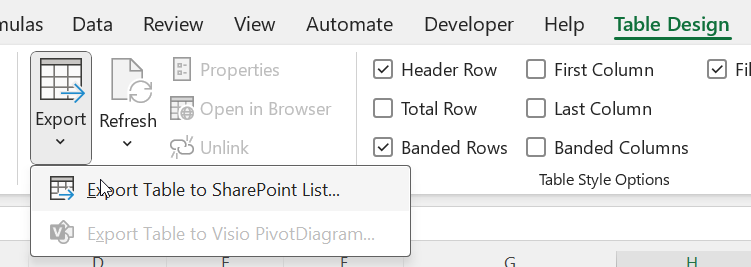
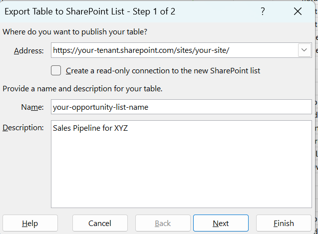

### About
Use this guide if you would like to deploy this pipeline as a citizen developer, do not have access to or would otherwise prefer to avoid the powershell required to perform automated list deployment.

If you plan to deploy more than a handful of these sites, I recommend you investigate the automated methods documented in the [admin guide](./admin-guide.md).  Setting this up without the use of templates is tedious, and realistically takes about 15 minutes.  An automated deploy is available in moments, without any tweaks needed, and can be integrated into automated, helpdesk-triggered workflows.

In either case, it is **strongly** recommended that maintain your RBAC permissions at the site level (as opposed to list level). To maintain close and segmented control of permissions, consider deploying each sales pipeline to its own dedicated sharepoint site.  If you choose to deploy multiple sales pipelines to the same sharepoint site, please consider leveraging [automated deployment](./admin-guide.md) methods to ensure the lists are secured according to your business requirements.

Before deploying on your own, read the short [security guide](security.md) to learn or refresh your memory around regulatory compliance requirements for systems like this.

Refer to the [code guide](./code-guide.md) if you are interested in adapting the m code to other use cases or learning more about the formulas leveraged in visualizations.

### Process

#### Locate your Tenant Name

Before you proceed, you will need your sharepoint **tenant name** and a sharepoint **site name**

To determine your **tenant name**, navigate to <a href="https://portal.office.com" target="_blank">portal.office.com</a> and select "Apps" in the left navigation.  Click on "Sharepoint".  The string before sharepoint.com is your tenant name.  In the following example it is "yourPortalName".

https://**yourPortalName**.sharepoint.com/_layouts/15/sharepoint.aspx?&login_hint=yourUserNameg@yourOrgDomain.com

#### Locate or create a Sharepoint Team Site 

Refer to [this video](https://www.youtube.com/embed/HQw5nRwAJFc?si=lQHoK6gRMOGDAvXW) for more information about creating SharePoint sites.

#### Create lists from [template.xlsx](../templates/template.xlsx)

**NOTE** The excel template is populated to generate a normal random distribution of opportunity amounts, win probability, close dates, milestones, and comment logs.  Each time you deploy from this template, you will have a unique data set.

1. navigate to the opportunities worksheet
2. Select any cell in the table and select the table design tab > Export > Export Table to Sharepoint list



3. Specify the tenant, site, and list names



4. Repeat the process with customers worksheet

**Note the sharepoint list names in this process.  You will need these for the excel file to locate the proper lists.

#### List settigs changes

- In the Opportunities list, go to list settings (gear icon top left)
- Turn on versioning.  Set the number of revisions this will carry.  **Note: comments will "roll off" after the number of retained versions are exceeeded.  The automated deployment starts with 500 revisions retained.

#### Column additions & changes

**Customers**:
- Add "Website" column as HTML **case sensitive**

**Opportunities**:
- Hide Title Column
- Change Stage to Choice:
```
Lead Qualification
Nurturing
Proposal
Negotiation
Project Execution
Closeout
```
- Change the Status to Choice:
```
Active
At Risk
Critical
```
- Change Probability to Choice:
```
Low
Medium
High
```
- Add "Customer Name" column as Lookup to the Opportunities Table Name column
- Add "Comment Log" column as multi-line append changes

#### Verify List Setup
When complete, your lists should be comprised of the following at minimum

##### Opportunities List
- **Opportunity Name** (Text) - Opportunity name
- **Status** (Choice) - On Track, At Risk, Critical
- **Stage** (Choice) - Lead Qualification, Nurturing, Proposal, Negotiation, Project Execution, Closeout
- **Amount** (Currency) - Deal value
- **Probability** (Choice) - Low, Medium, High
- **CustomerId** (Lookup) - Link to Customers list
- **Opportunity Owner** (text) - Opportunity owner (recommend against turning this into a Person Data Type, as it can cause downstream power query issues)
- **Close** (Date) - Expected close date
- **NextMilestone** (Text) - Next milestone description
- **NextMilestoneDate** (Date) - Milestone deadline
- **Comment Log** (Multiple Lines, Append) - Activity notes

##### Customers List
- **Customer Name** (Text) - Company name
- **Primary Contact** (Text) - Main contact person
- **Primary Contact Title** (Text) - Contact job title
- **Alternate Contact** (Text) - Secondary contact
- **Alternate Title** (Text) - Secondary contact
- **Alternate Contact 2** (Text) - Secondary contact
- **Alternate Contact 2 Title** (Text) - Secondary contact
- **Website** (Hyperlink) - Company website

#### (optional) apply body JSON format
Leverage this as body JSON on the respective forms to clean up the look and feel for data entry.

Opportunity body JSON
```json
{
    "sections": [
        {
            "displayname": "Contact Information",
            "fields": [
                "Customer Name",
                "Opportunity Name",
                "Opportunity Owner"
            ]
        },
        {
            "displayname": "Status",
            "fields": [
                "Status",
                "Stage",
                "Next Milestone",
                "Next Milestone Date"
            ]
        },
        {
            "displayname": "Financial Details",
            "fields": [
                "Amount",
                "Probability",
                "Close"
            ]
        },
        {
            "displayname": "",
            "fields": [
                "Comment Log",
                "Title"
            ]
        }
    ]
}

```

Customer body JSON
```json
{
    "sections": [
        {
            "displayname": "Customer Details",
            "fields": [
                "Customer Name",
                "Website"
            ]
        },
        {
            "displayname": "Primary Contact",
            "fields": [
                "Primary Contact",
                "Primary Contact Title"
            ]
        },
        {
            "displayname": "Alternate 1 Contact",
            "fields": [
                "Alternate Contact",
                "Alternate Contact Title"
            ]
        },
        {
            "displayname": "Alternate 2 Contact",
            "fields": [
                "Alternate Contact 2",
                "Alternate Contact 2 Title",
                "Title"
            ]
        }
    ]
}
```


#### Prep the lists for prod
- Delete all rows
- Add a test customer
- Add a test opportunity
- Add users to the site members

#### Prep the excel file
- Open the excel
- Modify site URL and list names
- Refresh all
- Verify functionality

#### (Optional) Create and Link Calendar View
Lists has a very functional calendar view.  Navigate to the Opportunities list, and create it.  Note the view GUID and populate it in the settings.