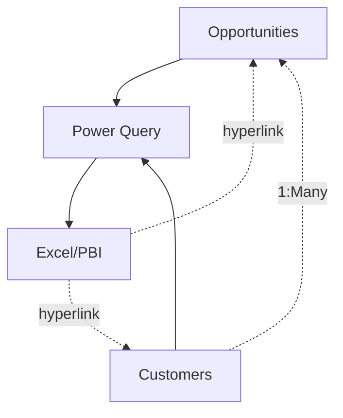

# Sharepoint Sales Funneler

[](https://opensource.org/licenses/MIT)
[](https://www.microsoft.com/sharepoint)
[](https://www.microsoft.com/excel)
[](https://powerquery.microsoft.com/)
[](https://github.com/PowerShell/PowerShell)

> A Sharepoint and Excel learning kit comprised of a production-grade sales pipeline management system for small to mid-sized teams.  Featuring  on-demand sync with Excel for visualization, and containing thorough documentation, it is a solid introduction to building a sustainable, governable two-tier application in the Microsoft ecosystem. The simple, two-table data model allows the exploration of these concepts without requiring a background in data structure management, while maintaining usefulness and stability when deployed in production.

Project builders will exercise skills with:
- Excel formulas, conditions, logic
- Dynamic Array Functions
- Data visualization methods
- Environment-portable ETL
- PowerShell PnP for list deployment


## Operator Features
- **Easy Governance Controls** - Protect sensitive data and comply with regulations using existing M365 governance policies
- **Flexible Deployment Methods** - Deploy manually as a [citizen developer](./docs/manual-deploy.md) with [powershell automation](./docs/auto-deploy.md)
- **Thorough Documentation** - Read the [code guide](./docs/code-guide.md) to understand the ground-up implementation
- **Integrated IAM** - Use regular M365 features for sharing, user tagging and commenting

## User Features
- **Dynamic Pipeline Dashboard** - Stateless, visually rich sales funnel in Excel and PBI (coming soon)
- **SharePoint Integration** - On-demand uni-directional sync with user-defined SharePoint lists
- **Fiscal Year Support** - Customizable fiscal quarters and calendar systems
- **Milestone Tracking** - Next steps and deadline management
- **Visual Status Indicators** - At-a-glance opportunity health
- **Hyperlinked Navigation** - Direct links to SharePoint records
- **Multi-user Collaboration** - SharePoint-backed team workflows

# Quick Start (Excel)
1. Identify the Site URL and List Prefix of your pipeline

```
https://contoso.sharepoint.com/sites/Sales/Lists/crmCustomers/
```
> tenant: **contoso**; 
> site: **Sales**;
> prefix: **crm**


2. Excel Configuration

Open `Sales Funnel Sharepoint.xlsx` and navigate to **Settings**


>Specify the SiteURL and prefix

3. Refresh and test links


4. (Optional) Configure refresh
Refresh settings are the defaults for Excel.  If using in production, consider adding a refresh on open, and clearing data on refresh.


## Documentation
- [Automated Deployment](./docs/auto-deploy.md): Automated deployment scripts and process
- [Manual Deployment](./docs/manual-deploy.md.md): Deployment guide for the citizen developer
- [Code Guide](./docs/code-guide.md): information about the ETL process and a breakdown of excel functions leveraged
- [Security Guide](./docs/security.md): information about security and the included scripts

## Architecture



## Screenshots

### Pipeline Dashboard

*Main dashboard showing opportunities, stages, and key metrics*

### SharePoint Integration

*List View in Sharepoint*


*Calendar view in Sharepoint*


*Opportunity form*


## Requirements

- **Microsoft 365** with SharePoint Online
- **Excel 365** with Power Query support
- **SharePoint Site** with list creation permissions


## Security & Permissions

### SharePoint Permissions
- CRUD permissions based on sharepoint list attributes

### Data Protection
- All data stored in Microsoft 365 tenant
- Inherits organizational security policies
- Audit trails available through SharePoint
- GDPR compliance through Microsoft 365

## Performance & Scalability

### Current Limits 
*(effectively tied to Sharepoint list scalability)*
- **Opportunities**: 5,000 items (recommended)
- **Concurrent Users**: ~50 users per list

### Scaling Recommendations
- Archive closed opportunities annually
- Consider dedicated SharePoint sites for scaleout and refined RBAC segmentation

## Known Issues
- comment log disappears from excel power query, but remains in list (versioning limitation)

## Roadmap
- M code refactor to resolve commment log issue
- PBI dashboard
- Expand customer metadata
- Recurring revenue setup
- User-defined Phase
- User defined Status