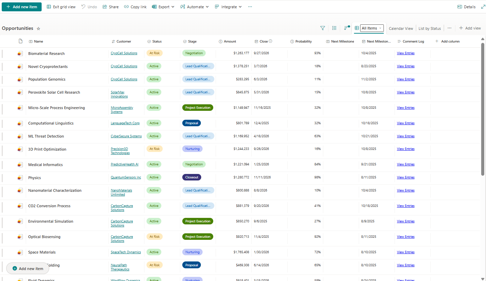

# Sharepoint Sales Funneler

[](https://opensource.org/licenses/MIT)
[](https://www.microsoft.com/sharepoint)
[](https://www.microsoft.com/excel)
[](https://powerquery.microsoft.com/)

> A simple Sharepoint-based sales pipeline management system with on-demand integration with Excel for visualization.

## Features

- **Dynamic Pipeline Dashboard** - Stateless, visually rich sales funnel in Excel
- **SharePoint Integration** - On-demand uni-directional sync with user-defined SharePoint lists
- **Fiscal Year Support** - Customizable fiscal quarters and calendar systems
- **Milestone Tracking** - Next steps and deadline management
- **Visual Status Indicators** - At-a-glance opportunity health
- **Hyperlinked Navigation** - Direct links to SharePoint records
- **Multi-user Collaboration** - SharePoint-backed team workflows

## Screenshots

### Pipeline Dashboard

*Main dashboard showing opportunities, stages, and key metrics*

### SharePoint Integration

*List View in Sharepoint*

*Calendar view in Sharepoint*

*Opportunity form*


## Architecture


## Requirements

- **Microsoft 365** with SharePoint Online
- **Excel 365** with Power Query support
- **SharePoint Site** with list creation permissions

## Quick Start

### 1. Clone Repository
```bash
git clone https://github.com/pgaljan/funneler.git
cd funneler
```

### 2. Deploy SharePoint Lists

This guide shows the manual steps to deploy this solution.  For automated deploymeds, please refer to the [admin-guide]()

#### Option 2: Manual


### 3. Configure Excel Dashboard
1. Open `Sales Funnel SharePoint.xlsx`
2. Update Settigns
#### Excel Settings
Update the following in the Settings sheet:

| Setting | Description | Example |
|---------|-------------|---------|
| Site URL | SharePoint site URL | `https://company.sharepoint.com/sites/SalesFunnel/` |
| Customers List | Sharepoint list name | `healthcareCustomers`|
| Opportunities List | Sharepoint list name | `healthcareOpportunities`|
| FY Start | Fiscal year start date | `2025-Jul-01` |
| Probability Threshold | Minimum % for forecasting | `75%` |

3. Refresh Power Query connections
4. Save to shared location

## Repository Structure

```
sales-funnel-sharepoint/
├── Sales Funnel.xlsx       # Main Excel dashboard
├── templates/
│   ├── opportunities.stp   # Sharepoint template
│   ├── template.xlsx       # Excel template
│   └── customers.stp       # Sharepoint template
├── deployment/
│   ├── SalesFunnel.xml     # (Roadmap) PnP provisioning template
│   ├── deploy.ps1          # (Roadmap) Deployment script
│   └── permissions.ps1     # (Roadmap) Security configuration
├── power-query/
│   ├── opportunities.m     # (Roadmap) Opportunities data source
│   └── customers.m         # (Roadmap) Customers data source
├── docs/
│   ├── images/
│   ├── user-guide.md       # (Roadmap)
│   ├── code-guide.md       # m code and excel formulas
│   └── troubleshooting.md  # (Roadmap)
└── README.md
```

## Usage Examples
Roadmap - workflow gif

## Security & Permissions

### SharePoint Permissions
- CRUD permissions based on sharepoint list attributes

### Data Protection
- All data stored in Microsoft 365 tenant
- Inherits organizational security policies
- Audit trails available through SharePoint
- GDPR compliance through Microsoft 365

## Performance & Scalability

### Current Limits 
*(effectively tied to Sharepoint list scalability)*
- **Opportunities**: 5,000 items (recommended)
- **Concurrent Users**: ~50 users per list

### Scaling Recommendations
- Archive closed opportunities annually
- Consider dedicated SharePoint sites for scaleout and refined RBAC segmentation

## Known Issues
- comment log disappears from excel power query, but remains in list (versioning limitation)

## Roadmap
- Configurable list names
- List View linking
- Sharepoint deployment template and powershell
- Full documentation
- M code refactor to resolve commment log issue
- PBI dashboard
- Expand customer metadata
- Recurring revenue setup
- User-defined phases